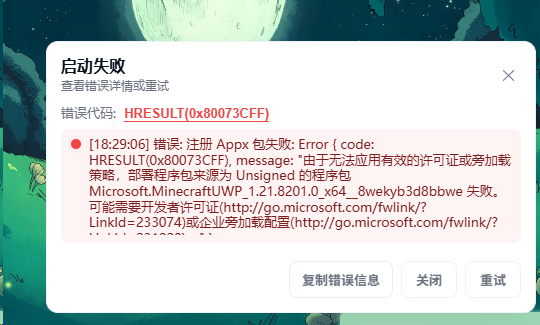

# 安装帮助

## BedrockBoot

在使用 BedrockBoot 下载功能的时候，有部分用户会遇到以下一些报错提示：  

*(以上图片为群友所提供)*

### 1.提示含有 “无法卸载。请联系...”

可前往 BedrockBoot 主页面下的 “工具箱” 页面，找到 “卸载 Minecraft” 工具项，单击 “卸载” 即可解决

### 2.提示含有 “URL 不得为空...”

这是这个版本已经被微软从服务器中删除，无法获取下载地址导致的，可切换临近的版本安装。

## BMCBL 启动器

图片中的这种错误是系统未开启开发者模式导致的，需要前往 系统设置>开发人员设置>启用开发者模式 把系统开发者模式打开即可。